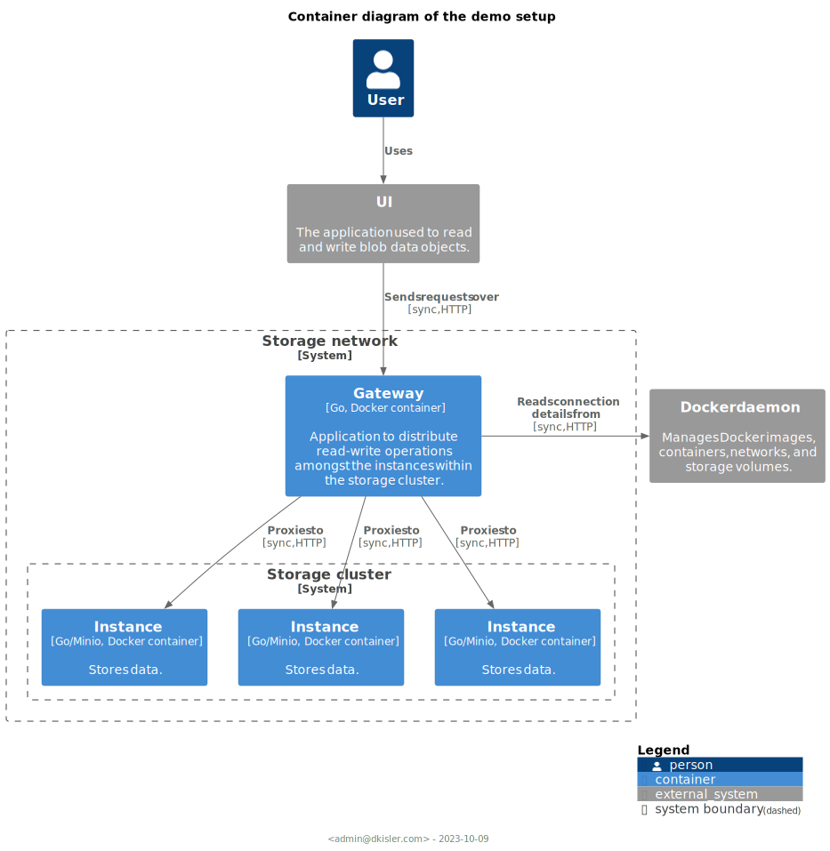
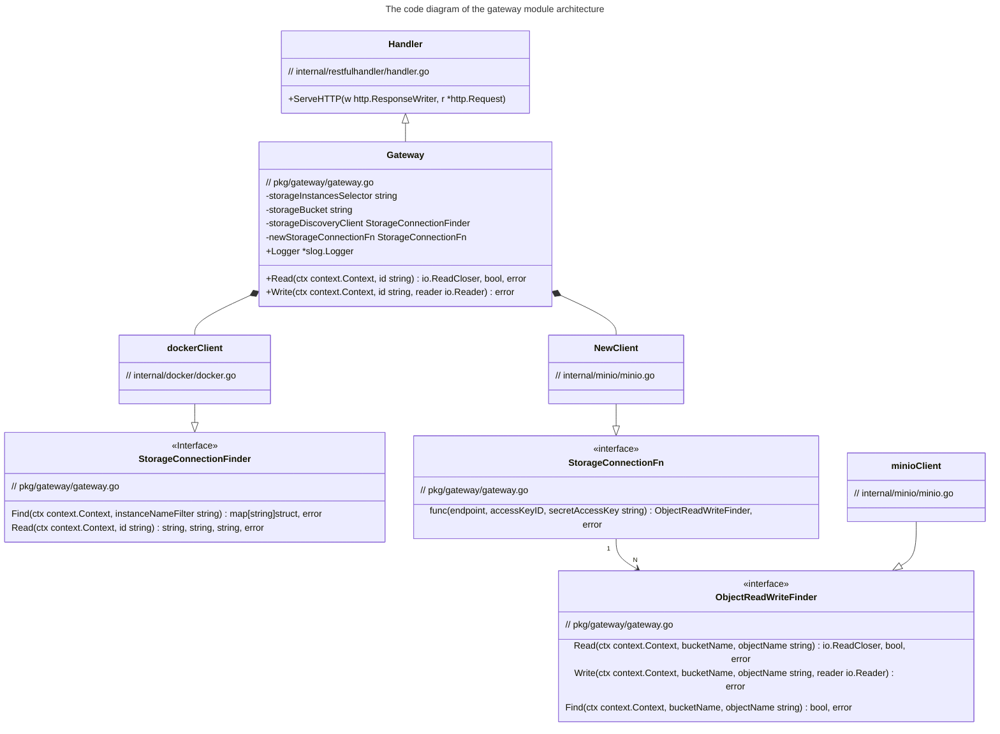

# Object storage gateway

The repository contains the codebase of the `gateway` application which distributes Read and Write operations among the 
object storage instances in a cluster.

### Shortcuts

* [Demo](#demo)
  + [Test scenario](#test-scenario)
* [How it works](#how-it-works)
* [How to extend](#how-to-extend)

## Demo

The demo setup consists of three [Minio](https://min.io/) objects storage instances and a single gateway instance.
Find the architecture details in the diagram below.



### How to run

Follow the instructions below to provision the demo environment locally. **Note** that the gateway process must have
access to the docker socket `/var/run/docker.sock`.

#### Prerequisites

- Docker 23+
- docker-compose

Run to provision the demo setup:

```
docker-compose up --build
```

<details>
<summary><strong>Env Variables Configurations</strong></summary>

The gateway process can be configured using the environment variables listed in the table.

| Variable Name              | Definition                         | Default                      |
|:---------------------------|:-----------------------------------|:-----------------------------|
| STORAGE_INSTANCES_SELECTOR | Selector to identify storage nodes | "amazin-object-storage-node" |
| LOG_DEBUG                  | Logger's debug verbosity level     | true                         |

</details>

### Test scenario

_Given_ that the demo setup [provisioned](#how-to-run) successfully,

_when_ the [script](scripts/e2e-tests.sh) is executed,

_then_ three end-to-end/round-trip upload+download tests are expected to succeed.

The following test files are used:

- The text file with a dummy text sample "foo bar baz";
- The `LICENSE` file from the OpenTofu v1.6.0-alpha1 release;
- The [`tofu.zip` file](https://github.com/opentofu/opentofu/releases/download/v1.6.0-alpha1/tofu_1.6.0-alpha1_darwin_arm64.zip)
  from the OpenTofu v1.6.0-alpha1 release.

Run the command to execute the tests:

```commandline
make e2etests
```

**Note**: the execution requires `bash`, `curl`, `wc`, `grep` and `diff`.

### Endpoints

The gateway can be called from the host machine using the URL: http://localhost:3000.
See the API contract in the [spec file](internal/restfulhandler/apispec.yaml).

## How it works

The gateway webserver is a reverse proxy which also functions as the storage cluster's load balancer. Its modus operandi can be described as follows:

1. Read and validate HTTP request.
2. Return the response with the error message if the request is invalid. Find additional details in the [API spec file](internal/restfulhandler/apispec.yaml).
3. Read the list of object storage instances available in the cluster using a "service discovery" mechanism.
4. Communicate to the storage cluster node:

- When a _read_ request is received, the gateway attempts to fetch the requested data by sequentially sending the "read command" to each discovered instance over the network.
  Data will be proxied to the user as soon as the "read command" returns the "found" status. An error message will be returned if no requested data is found or the read operation fails.

- When a _write_ request is received, the gateway "scans" the cluster by sequentially sending the "find command" to each discovered instance over the network. Provided data will overwrite existing object upon discovery.
  If the data is not found, a new object will be created, and the data will be written to the instance selected based on the `objectID` provided by the user. The HTTP status code 201 shall be expected if the write operation succeeds,
  other an error message will be returned.

### Module Design



## How to extend

The gateway module can be extended to use different storage and "service discovery" backends:

- a new service discovery client is required to implement the interface `StorageConnectionFinder`.
- a new storage backed client is required to implement the interface `ObjectReadWriteFinder`.

Find a code snippet example below.

```go
package main

import (
	"context"
	"log"
	"log/slog"
	"os"
	"strings"

	"github.com/kislerdm/minio-gateway/pkg/gateway"
)

func NewStorageConnection(ipAddress, accessKeyID, secretAccessKey string) (gateway.ObjectReadWriteFinder, error) {
	panic("implement me")
	// Definition of the logic to initialise your storage backend.
}

type myServiceDiscoveryClient struct {
	// Attributes of your ServiceDiscoveryClient
}

func (m myServiceDiscoveryClient) Find(ctx context.Context, instanceNameFilter string) (map[string]struct{}, error) {
	panic("implement me")
	// Definition of the logic to find storage instances.
}

func (m myServiceDiscoveryClient) Read(ctx context.Context, id string) (string, string, string, err error) {
	panic("implement me")
	// Definition of the logic to retrieve the details required to connected to the storage instance.
}

func main() {
	const (
		storageInstanceSelector = "my-storage-instance"
		storageBucket           = "mybucket"
	)

	gw, err := gateway.New(storageInstanceSelector, storageBucket, &myServiceDiscoveryClient{}, NewStorageConnection,
		slog.New(slog.NewJSONHandler(os.Stdout, &slog.HandlerOptions{AddSource: true})),
	)
	if err != nil {
		log.Fatalln(err)
	}

	if err := gw.Write(context.Background(), "foo", strings.NewReader("bar")); err != nil {
		log.Fatalln(err)
	}
}
```

## How to contribute

**Requirements**:

- Go 1.21
- Docker and docker compose
- gnuMake/cmake

1. Submit the GitHub issue with a bug report or feature request
2. Open PR with a code proposal for the code modification, or extension.

Please make sure that the following commands succeed before pushing changes.

- Run unit tests:

```commandline
make tests
```

- Run linters:

```commandline
make lint
```

## License

The codebase present in the repository is distributed under the [MIT license](LICENSE).

The images and graphical material is distributed under
the [CC BY-NC-SA 4.0 DEED](https://creativecommons.org/licenses/by-nc-sa/4.0/) license.

## Disclaimer

The project was developed as a solution addressing the problem
described [here](https://github.com/spacelift-io/homework-object-storage).
