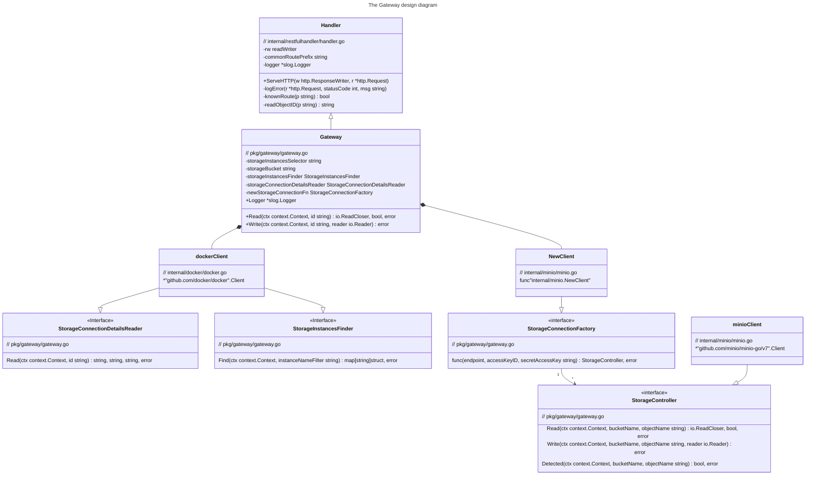

# Blob Storage Gateway

The codebase defines the `Gateway` to distribute Read and Write operations among the Minio Object Storage instances.

### Shortcuts 

* [How to run](#how-to-run)
* [Demo](#demo)
* [Useful Commands](#commands)

## Module Design



## Gateway Deployment as a WebServer

### Endpoints

See the endpoints definition in the [spec file](internal/restfulhandler/apispec.yaml).

## How to run

### Prerequisites

- Docker 23+
- docker-compose

### Requirements

- The Minio Cluster Instances and the Gateway must run as Docker processes.
- The Gateway must share the network with the Minio Cluster.
- The Gateway mush have access to the socket `/var/run/docker.sock` to communicate to the Docker daemon over HTTP.

Run to provision a setup with three Minio instance and a Gateway instance:

```
docker-compose up --build
```

### Env Variables Configurations

The Gateway process can be configured using the environment variables listed in the table.

| Variable Name              | Definition                         | Default                      |
|:---------------------------|:-----------------------------------|:-----------------------------|
| STORAGE_INSTANCES_SELECTOR | Selector to identify storage nodes | "amazin-object-storage-node" |
| PORT                       | Port for the webserver to listen   | 3000                         |
| LOG_DEBUG                  | Logger's debug verbosity level     | true                         |

## Demo

_Given_ that the local environment was [provisioned](#how-to-run) successfully,

_when_ the [script](e2e-test/e2e-tests.sh) is executed,

_then_ three end-to-end/round-trip upload+download tests are expected to succeed.

The following test files are used:
- The text file with a dummy text sample "foo bar baz";
- The `LICENSE` file from the OpenTofu v1.6.0-alpha1 release;
- The [`tofu.zip` file](https://github.com/opentofu/opentofu/releases/download/v1.6.0-alpha1/tofu_1.6.0-alpha1_darwin_arm64.zip) from the OpenTofu v1.6.0-alpha1 release.

Run the command to execute the tests:

```commandline
make e2etests
```

**Note**: the execution requires `bash`, `curl`, `wc`, `grep` and `diff`.  

## Commands

_Requires_ gnuMake/cmake

- See help:

```commandline
make help
```

- Run unit tests:

```commandline
make tests
```

- Run linters:

```commandline
make lint
```

**Note**: the command execution requires `Docker`.

## License

The codebase present in the repository is distributed under the [MIT license](LICENSE).

The images and graphical material is distributed under
the [CC BY-NC-SA 4.0 DEED](https://creativecommons.org/licenses/by-nc-sa/4.0/) license.

## Disclaimer

The project was developed as a solution addressing the problem
described [here](https://github.com/spacelift-io/homework-object-storage).
